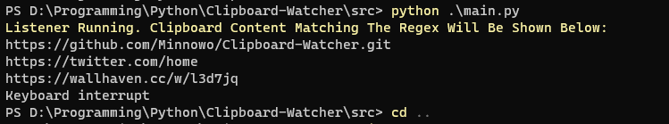

## Clipboard-Watcher
A program to watch the clipboard for specific regex matches


### Config

See the top of [main.py](src/main.py)  
```py
        
    # will only write text that matches anything in here 
    MATCHES = [ 
            
            # matches urls 
            re.compile(r"(https?://[^\s]+)") 
        ]

    # the delay between clipboard checks 
    DELAY_MS = 50

    # the output file where the data is put (1 match from above per line)
    OUTPUT_FILE = "clipboard-urls.txt"

    # file write mode
    # if you want to use 'w' then you probably want to change the class
    # so that it doesn't call handle.close() after each write,
    # otherwise it will overwrite all the content each time
    # basically comment out the last 3 lines of 'set_value(self)'
    WRITE_MODE = "a"

    # if you don't want the program to remove whitespace (i.e call str.strip())
    # see uwu.write_url and remove the url = url.strip() 

```


### Usage

Just run [main.py](src/main.py) and that's it  

Ctrl + C in the console to close the app  

The program will keep a cache of values already saved so it won't keep any duplicates items  
  

